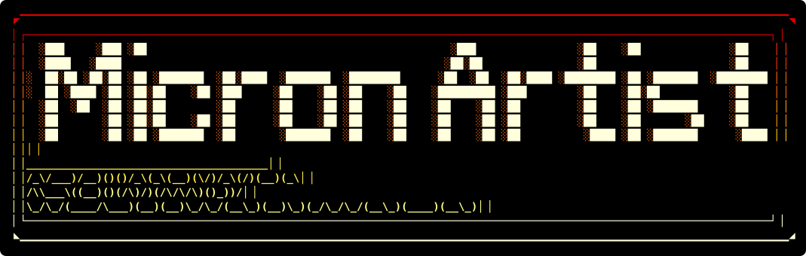
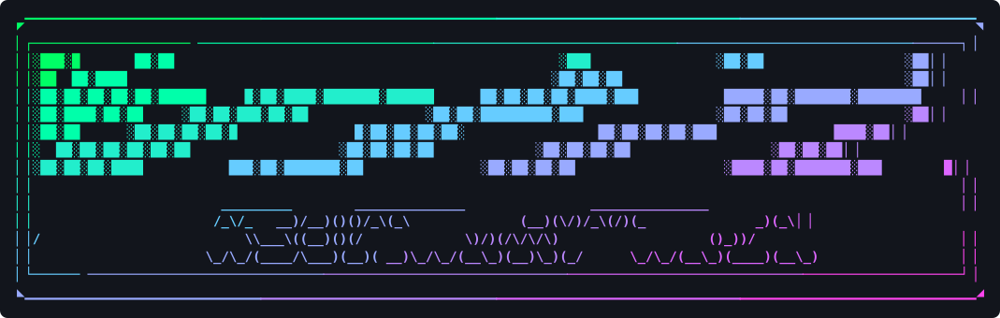

NomadNet ASCII art maker. Paste ASCII art, colour it, get micron code you can
drop straight into a `.mu` page.

That banner is not a screenshot: it is the tool's own output. The demo page,
coloured with the recipe `MA1.fire.dark-void.none.000.shade.b.1.110`, written out
as vector text. Colouring by character density is what gives each stroke a dark
red edge around a pale hot core: the lettering is drawn with `░` and `█`
together, and the two land at opposite ends of the ramp.

**[Open Micron Artist](https://fr33n0w.github.io/micron-art/)**

It is a single static `index.html` with no dependencies and no build step, so
GitHub Pages serves it as is.

## What it does

- 12 bit colours (`` `Frgb ``, every reader) or 24 bit (`` `FTrrggbb ``, NomadNet
  0.9.11 and later, exact with `colormode = 24bit`), with a step count to keep
  24 bit pages small
- gradients by row, column, both diagonals, radial, spiral, wave, or by
  character density (`░▒▓█`)
- 34 palettes for the art, plus 16 near-black ones reserved for backgrounds, all
  shown as colour strips so you pick by eye
- a custom palette: four colour wells, interpolated into the same eight-step
  ramp the built-in palettes use, so every effect works on it unchanged
- backgrounds: none, one solid colour, a ramp, or inverted (the ramp paints the
  background and the glyphs go dark on top of it), optionally only behind the
  glyphs so the art keeps its shape
- effects: scanlines, reversed ramp, random colour per character, grain, bold,
  edge fade, bounce (ramp out and back), edge glow, and a B/W switch that drops
  everything to grey by luminance
- Magic rolls everything at once, usually as one of eleven named looks (crt,
  neon, poster, chrome, rainbow, heat, pastel, vapor, monotone, duotone,
  glitch), often inventing a palette from a colour harmony; Shuffle draws a new
  set of random colours
- art transforms: Mirror, Flip, Frame (12 border styles), Shade (steps every
  block one level denser), Trim, and Undo
- live preview with adjustable line spacing, plus copy and download
- a recipe code that carries every setting, so a look can be saved or passed on

## Recipe codes

The box at the bottom holds one line that describes the whole configuration:

```
MA2.acid.dark-void.ramp.002.diag.sr.k3f9x.110.24s16
```

Fields in order: format marker, art palette, background palette, background
mode, solid colour, gradient direction, effect flags, the random seed in base
36, the preview line spacing, and the colour depth (`12`, or `24s` plus the
step count, `24s0` for smooth). When the custom palette is in use, its four
stops follow as the last field. Old `MA1` codes still apply, as 12 bit.

Flags: `s` scanlines, `r` reverse, `x` random per character, `c` centred, `g`
grain, `b` bold, `f` fade, `h` halo, `p` bounce, `e` edge glow, `w` black and
white, `0` none.

Paste a code in, press Apply, and the same art comes out the same way. Palettes
are stored by name rather than by index, so old codes keep working when new
palettes are added.

Everything happens in the browser. Nothing is uploaded.

## Micron notes

- classic colours are 12-bit, three hex digits: `` `F0f0 `` foreground,
  `` `B002 `` background, `` `f `` and `` `b `` close them
- 24-bit colours add a `T` and six digits: `` `FT00ff00 ``, `` `BT000022 ``.
  An older reader prints them as text
- backticks and backslashes in the art are escaped. A lone backslash arms
  micron's escape and keeps it armed until the next backtick, which then gets
  eaten, so the colour tag would show up as literal text
- line spacing is a preview setting only. Micron has no such tag: the reader's
  terminal decides it

## Related

Use this for headers and art. For whole pages, see
[Micron Composer](https://fr33n0w.github.io/micron-composer/).

## Licence

[CC BY-NC-SA 4.0](https://creativecommons.org/licenses/by-nc-sa/4.0/) -
Attribution, NonCommercial, ShareAlike.

Use it, modify it, share it. Do not sell it and do not republish it under
another name. If you share it, modified or not, credit the author, name this
project, and link back to <https://github.com/fr33n0w/micron-art>. Anything
built on it carries the same licence. Full text in [LICENSE](LICENSE).

---



<sub>The same art again, this time on `MA1.aurora.dark-void.none.000.diag.b.1.110`.
One recipe, two very different pictures.</sub>
